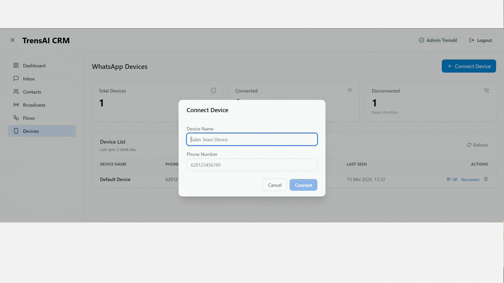

# TrensAI CRM

> 🚀 **Open Source. Self-Hosted. Production-Ready.**
>
> A modern, modular SaaS platform that brings together WhatsApp messaging, CRM, live chat, and AI-powered automation.

<div align="center">
  
</div>

[](https://opensource.org/licenses/MIT)
[](https://github.com/ajie9988/trensai-crm)
[](https://github.com/ajie9988/trensai-crm)
[](https://github.com/ajie9988/trensai-crm)
[](https://nextjs.org/)
[](https://laravel.com/)
[](https://www.typescriptlang.org/)
[](https://pnpm.io/)
[](https://turbo.build/)
[](https://www.docker.com/)
[](https://github.com/features/actions)
[](https://codeql.github.com/)

## ✨ Features

### 🔌 WhatsApp Integration
- Native Baileys integration for WhatsApp messaging
- Multi-device support (QR Code & Pairing Code)
- Auto-reconnect with session persistence
- Support for all message types (text, media, documents, interactive)

### 💬 Live Chat & Inbox
- Real-time message synchronization
- Multi-agent assignment and collaboration
- Chat notes and internal comments
- Message labels, tags, and filtering
- Typing indicators and read status
- Emoji reactions and quoted replies

### 📊 CRM System
- Customer 360 profiles
- Contact segmentation and tags
- Custom fields and metadata
- Activity timeline and history
- Pipeline management

### 📱 WhatsApp Capabilities
- **Multi-Device Support**: Connect multiple WhatsApp accounts simultaneously.
- **LID-Aware Sync**: Intelligent mapping of WhatsApp Linked Identities (LID) to real phone numbers.
- **Full Media Support**: Seamlessly send/receive Images, Videos, Audio, and Documents with original metadata (captions, filenames, mimetypes).
- **Hybrid Real-time Stream**: Configurable real-time delivery via SSE (Production) or Smart Polling (Local Dev).
- **Group Management**: Full support for WhatsApp Groups with JID preservation.

### 🤖 AI Assistant
- Multiple AI provider support (OpenAI, Claude, Gemini, Ollama)
- AI auto-reply with context awareness
- FAQ knowledge base
- Intent detection
- Conversation summarization
- Smart routing

### 🔄 Automation & Flows
- Visual drag-and-drop flow builder
- Trigger-Condition-Action system
- Workflow scheduling and execution
- Webhook integrations
- Queue-based processing

### 📢 Broadcast System
- Bulk messaging campaigns
- Message templates with personalization
- Delivery reports and analytics
- Scheduled sending with delay randomizer
- Retry mechanism

### 🏗️ Architecture
- **Monorepo** managed with **pnpm Workspaces**
- **Turborepo** for optimized build pipeline and caching
- **GitHub Actions** CI/CD with automated testing
- **CodeQL** static analysis for advanced security
- **Trivy** vulnerability scanning for Docker images
- **Renovate** for automated dependency management
- **Docker** containerization with optimized multi-stage builds
- **Fully Typed** TypeScript frontend

## 🚀 Quick Start

### Prerequisites
- Docker & Docker Compose
- Git
- Minimum 2GB RAM

### Installation (30 seconds)

```bash
# Clone the repository
git clone https://github.com/ajie9988/trensai-crm.git
cd trensai-crm

# Install pnpm (if not already installed)
npm install -g pnpm

# Install dependencies for the whole monorepo
pnpm install

# Copy environment file
cp .env.example .env

# Start with Docker
pnpm docker:up

# Access the platform
# Dashboard: http://localhost:3000
# API: http://localhost:8000/api
```

**Default Credentials:**
- Email: `admin@trensai.local`
- Password: `password`

See [INSTALL.md](./docs/INSTALL.md) for detailed setup instructions.

## 📚 Documentation

- [Build & Architecture Summary](./BUILD_SUMMARY.md)
- [Installation Guide](./docs/INSTALL.md)
- [API Documentation](./docs/API.md)
- [Architecture Guide](./docs/ARCHITECTURE.md)
- [Smoke Test Guide](./docs/SMOKE_TEST.md)
- [Contributing Guidelines](./CONTRIBUTING.md)
- [Docker Setup](./docs/DOCKER.md)
- [Plugin Development](./docs/PLUGINS.md)

## 🎯 Core Stack

### Backend
- **Framework**: Laravel 11 (PHP 8.3)
- **Database**: MySQL 8.0
- **Cache**: Redis 7.0
- **Queue**: Redis Queues
- **Real-time**: Socket.IO
- **Auth**: Laravel Sanctum

### Frontend
- **Framework**: Next.js 14
- **Language**: TypeScript
- **Styling**: TailwindCSS + Shadcn UI
- **State**: Zustand
- **Data Fetching**: React Query
- **Real-time**: Socket.IO Client

### WhatsApp Engine
- **Runtime**: Node.js 18+
- **Library**: Baileys
- **Message Queue**: Redis
- **Session Store**: Redis

### AI Engine
- **OpenAI**: GPT-4, GPT-3.5
- **Anthropic**: Claude 3
- **Google**: Gemini
- **Open Source**: Ollama

## 📁 Project Structure

```
trensai-crm/
├── apps/
│   ├── backend/              # Laravel API
│   ├── frontend/             # Next.js Dashboard
│   ├── wa-engine/            # WhatsApp Node.js Service
│   ├── ai-engine/            # AI Processing Service
│   └── worker/               # Background Job Worker
├── packages/
│   ├── sdk/                  # TypeScript SDK
│   ├── shared-ui/            # React Components
│   ├── shared-types/         # Shared TypeScript Types
│   └── flow-engine/          # Flow Builder Engine
├── docker/                   # Docker configurations
├── docs/                     # Documentation
├── examples/                 # Example implementations
└── scripts/                  # Utility scripts
```

## 🏛️ Architecture

### Modular Domain Structure

The backend is organized as a **modular monolith** using Laravel Modules:

```
Modules/
├── Auth/          # Authentication & Authorization
├── Tenant/        # Multi-tenancy
├── User/          # User Management
├── Device/        # WhatsApp Device Management
├── Chat/          # Chat & Messaging
├── Contact/       # Contact Management
├── Broadcast/     # Bulk Messaging
├── Automation/    # Automation Rules
├── Flow/          # Flow Builder & Execution
├── AI/            # AI Integration
├── CRM/           # CRM Features
├── Analytics/     # Analytics & Reporting
├── Plugin/        # Plugin System
└── Settings/      # System Settings
```

### Event-Driven Architecture

- **Webhook Triggers**: External events
- **Message Events**: New messages, read status
- **Device Events**: Connection, disconnection
- **Flow Events**: Flow execution, completion
- **AI Events**: Intent detection, response generation

### Real-time Communication

- **Socket.IO** for bi-directional communication
- **Redis Adapter** for scaling across multiple servers
- **Event Broadcasting** for team collaboration
- **Presence Tracking** for user status

## 🔐 Security Features

- ✅ Multi-tenant data isolation
- ✅ Role-Based Access Control (RBAC)
- ✅ Rate limiting & DDoS protection
- ✅ Input validation & sanitization
- ✅ Webhook signature verification
- ✅ Audit logging
- ✅ Encrypted session management
- ✅ API token management

## 🐳 Docker Deployment

```yaml
Services:
- Nginx (Reverse Proxy)
- Laravel API
- Next.js Frontend
- WhatsApp Engine
- AI Engine
- MySQL Database
- Redis Cache
- Job Worker
```

One-command deployment:
```bash
docker compose up -d
```

See [DOCKER.md](./docs/DOCKER.md) for advanced configurations.

## 📊 API Overview

All endpoints are RESTful and versioned:

```
GET    /api/v1/contacts
POST   /api/v1/contacts
GET    /api/v1/contacts/{id}
PUT    /api/v1/contacts/{id}
DELETE /api/v1/contacts/{id}

GET    /api/v1/chat/conversations
POST   /api/v1/chat/conversations/{id}/messages
GET    /api/v1/chat/conversations/{id}/messages

POST   /api/v1/broadcast
GET    /api/v1/broadcast/{id}/status

GET    /api/v1/flows
POST   /api/v1/flows
POST   /api/v1/flows/{id}/execute

GET    /api/v1/ai/chat
POST   /api/v1/ai/chat
```

Full API documentation: [API.md](./docs/API.md)

## 🧪 Testing

```bash
# Backend tests
cd apps/backend
php artisan test

# Frontend tests
cd apps/frontend
npm test

# E2E tests
npm run e2e
```

## 📈 Performance Metrics

- **API Response**: < 200ms (p95)
- **Real-time Latency**: < 100ms
- **Throughput**: 10k+ messages/minute
- **Scalability**: Horizontal (via Docker Compose or K8s)

## 🎉 Roadmap

- [ ] Telegram support
- [ ] Email integration
- [ ] WhatsApp Business API integration
- [ ] SMS gateway
- [ ] Shopify integration
- [ ] Analytics dashboard
- [ ] Advanced reporting
- [ ] Mobile app
- [ ] Kubernetes support
- [ ] GraphQL API

## 🤝 Contributing

We welcome contributions! See [CONTRIBUTING.md](./CONTRIBUTING.md) for guidelines.

### Areas to Contribute
- Bug fixes
- Feature implementations
- Documentation
- Plugin development
- Performance optimization
- Security improvements

## 📄 License

This project is licensed under the **MIT License** - see [LICENSE](./LICENSE) file for details.

**Key Points:**
- ✅ Commercial use allowed
- ✅ Modification allowed
- ✅ Distribution allowed
- ✅ Private use allowed
- ✅ Simple and permissive

## 🙏 Support

- **Documentation**: [docs/](./docs/)
- **GitHub Discussions**: [Join the community](https://github.com/ajie9988/trensai-crm/discussions)
- **GitHub Issues**: [Report bugs](https://github.com/ajie9988/trensai-crm/issues)
- **GitHub Discussions**: [Ask questions](https://github.com/ajie9988/trensai-crm/discussions)

## 💡 Credits

Built by the community for the community.

### Technologies
- Laravel & PHP community
- Next.js & React community
- Baileys library
- Socket.IO

---

**⭐ If you find this project helpful, please star us on GitHub!**

Made with ❤️ for the open-source community
